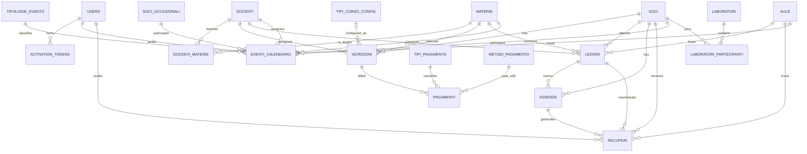
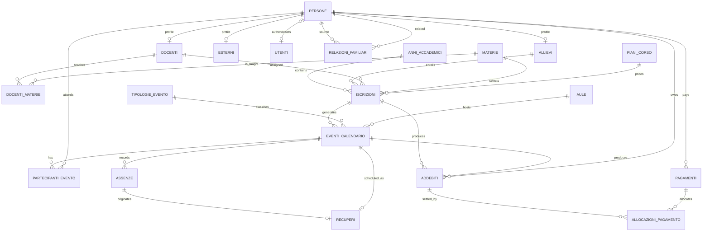

# MusicAll — Analisi funzionale, tecnica e dati

**Data dell'analisi:** 26 settembre 2026
**Fonti primarie:** `database/musicall.sqlite` (schema e dati letti in sola lettura), migrazioni SQL/PHP e documentazione Markdown del repository.
**Ambito:** funzionalita attualmente implementate o documentate. Le funzioni future non ancora specificate non sono state introdotte nello schema target.

## 1. Esito e decisione architetturale

Il database live e una SQLite da 806.912 byte, con integrita fisica valida (`PRAGMA integrity_check = ok`). E il database di **test funzionale** e non viene considerato un candidato alla produzione; per questo l'analisi non ne prescrive la correzione in-place, ma ne usa struttura e dati per individuare le capacita da preservare nella baseline produttiva.

- sono presenti 47 tabelle, nessuna vista, 19 violazioni di chiave esterna e tre FK dirette verso la tabella inesistente `corsi_soci`;
- convivono almeno tre modelli: anagrafica semplice (`soci`, `docenti`), anagrafica normalizzata interrotta (`persone_bck`, `soci_old`, dettagli ruolo) e modello di iscrizioni/calendario piu recente;
- le migrazioni non sono una catena ripetibile: mescolano SQL SQLite e MySQL, riferiscono tabelle rinominate o rimosse e alcune non risultano applicate coerentemente allo schema live.

Il file `database\schema_produzione.sql` e pertanto la **baseline proposta** per una nuova installazione SQLite. Normalizza l'anagrafica, elimina le relazioni polimorfe e le duplicazioni del modello corrente, abilita le FK e conserva le capacita funzionali rilevate. Non deve essere eseguito sopra `musicall.sqlite`: per migrare dati esistenti va predisposto un ETL verificato.

## 2. Architettura applicativa osservata

L'applicazione e PHP con PDO/Eloquent, Bootstrap 5 e JavaScript. La configurazione predefinita seleziona `sqlite_file` e punta a `database/musicall.sqlite`; dichiara anche connessioni MySQL, PostgreSQL e SQL Server (`config\database.php`). Il modello applicativo dichiarato e MVC, con ruoli `admin`, `docente` e `segreteria`.

La configurazione richiede le FK SQLite, ma una connessione SQLite le applica solo se esegue `PRAGMA foreign_keys = ON`. La lettura diretta del file ha rilevato `foreign_keys = 0`; nella baseline proposta il pragma e la prima istruzione e l'applicazione deve impostarlo a ogni nuova connessione.

## 3. Mappa funzionale

| Dominio | Funzionalita rilevate | Stato delle evidenze |
|---|---|---|
| Accesso e sicurezza | utenti, ruoli, attivazione account, cambio password forzato, rate limit, log attivita/audit | Implementato in modo parziale; `activation_tokens` e popolata, ma la migration dei token reset non e presente nello schema live. |
| Anagrafica | soci/allievi, docenti, esterni/occasionali, contatti, famiglia, dati associazione | Implementato, con modelli sovrapposti e duplicati. |
| Didattica | materie, abilitazioni docente-materia, aule, lezioni ricorrenti, lezioni custom, laboratori | Implementato; alcune relazioni sono solo colonne senza FK. |
| Calendario e prenotazioni | eventi tipizzati, prenotazioni sala, ricorrenze, risorse/aula, partecipante, controlli di sovrapposizione | Implementato secondo i documenti; 84 eventi nel DB. |
| Assenze e recuperi | assenze allievo/docente, proposta/approvazione/rifiuto/annullamento recupero, controllo conflitti | Implementato; 17 assenze e 14 recuperi nel DB. |
| Iscrizioni e incassi | iscrizioni a corso, configurazione corsi/tariffe, quota annuale, pagamenti e metodi | Parzialmente implementato: 18 iscrizioni e nessun pagamento live. |
| Operazioni | note, chiusure, batch email, audit e log tecnici | Strutture presenti, quasi tutte senza dati. |

### Regole di business emerse

- Un evento e puntuale oppure ricorrente: i due casi sono mutuamente esclusivi e il DB live gia applica questo controllo.
- Un evento puo riguardare un socio oppure un socio occasionale, non entrambi.
- Un docente puo essere associato a piu materie; la coppia docente-materia deve essere unica.
- Una iscrizione collega socio, materia, docente, anno accademico e tipo corso. Nel live non esiste pero un vincolo univoco su tale combinazione.
- I recuperi derivano da un'assenza e da una lezione originaria; i documenti definiscono stato proposto/confermato/annullato e massimo tre recuperi garantiti per l'allievo, mentre l'assenza docente e sempre recuperabile.
- I documenti v3 descrivono quota associativa annuale, tessera, sconti familiari/pro-rata e pagamenti; sono requisiti da conservare ma non prova dell'implementazione completa.

### 3.1 Catalogo dei requisiti funzionali ricostruiti

Non esiste un documento formale che contenga un "Requisito X". La prima versione di questa analisi elencava i domini, ma non assegnava identificatori verificabili ai requisiti. Il seguente catalogo e stato ora ricostruito incrociando DB, endpoint API e controller PHP; `E` significa che il comportamento e riscontrato nel codice, `D` che e soltanto documentato o parzialmente realizzato.

| ID | Requisito funzionale | Stato | Evidenza principale |
|---|---|---|---|
| FR-01 | Gestire utenti, attivazione account, ruoli operativi e associazione opzionale di un account a un docente. | E | `UsersController.php`, `activation_tokens`, `api_docenti.php`. |
| FR-02 | Gestire anagrafiche di allievi, docenti ed esterni, con ricerca, creazione, modifica e disattivazione. | E | `SociController.php`, `DocentiController.php`, `api_soci.php`, `api_docenti.php`. |
| FR-03 | Assegnare una o piu materie a un docente e usare tale assegnazione nell'offerta didattica. | E | `DocentiController::salvaMaterie`, `docenti_materie`. |
| FR-04 | Configurare aule, materie, piani/tipi corso, tipi laboratorio e relativi partecipanti. | E | `AuleController.php`, `ConfigurazioneCorsiController.php`, API di configurazione. |
| FR-05 | Iscrivere un allievo a materia, docente, piano corso e anno accademico, consultando statistiche e stato dell'iscrizione. | E | `IscrizioniController::creaIscrizione/aggiornaIscrizione`, `api_iscrizioni.php`. |
| FR-06 | Pianificare, modificare e annullare lezioni, eventi e prenotazioni di aula, controllando le sovrapposizioni. | E | `api_lezioni.php`, `api_eventi.php`, `api_salva_prenotazione.php`, `api_check_conflicts.php`. |
| FR-07 | Registrare assenze di allievo o docente e ricercare quelle da recuperare con contatori per periodo. | E | `AssenzeController.php`, `api_salva_assenza_calendario.php`, `api_get_contatori_assenze.php`. |
| FR-08 | Creare, confermare, rifiutare o annullare recuperi e sincronizzarli al calendario, verificando la disponibilita dell'aula. | E | `RecuperiController.php`, `api_check_recupero_conflicts.php`, `api_sync_recuperi_calendario.php`. |
| FR-09 | Registrare, aggiornare, eliminare, filtrare e rendicontare pagamenti, scadenze e ritardi. | E | `PagamentiController.php`, `api_calcolo_pagamenti.php`. |
| FR-10 | Gestire pacchetti di lezioni custom e impedire il consumo oltre il numero acquistato. | E nel controller, non supportato dal live | `IscrizioniController::registraUtilizzoLezioneCustom` usa `is_pacchetto`, contatore e `utilizzo_lezioni_custom`, assenti dal DB live. |
| FR-11 | Tracciare operazioni e modifiche su record e gestire note, chiusure e job batch. | E/D | `AuditLogController.php` e tabelle operative; l'uso completo e parzialmente documentato. |

**Tracciabilita del Requisito X.** Da questo momento "Requisito X" deve essere espresso con uno degli ID `FR-01`--`FR-11`, oppure aggiunto al catalogo con criteri di accettazione. Per ciascun requisito il modello target dichiara tabelle e vincoli di copertura nella sezione 3.3. Un requisito non ancora identificato non puo essere dichiarato coperto: questa e una salvaguardia contro aggiunte implicite allo schema.

### 3.2 Differenze: database live di test e baseline di produzione

Lo schema di produzione **non e una copia corretta del DB di test**, ma un modello contrattuale nuovo. Le differenze sono intenzionali e preservano i requisiti elencati sopra:

| Area | DB live di test | Baseline `schema_produzione.sql` | Motivazione e requisiti coperti |
|---|---|---|---|
| Anagrafica | `soci`, `soci_old`, `persone_bck`, `docenti`, due modelli di esterno e dettagli ruolo disallineati. | `persone` come master, profili 1:1 `allievi`, `docenti`, `esterni`. | Evita duplicazione e FK verso generazioni diverse; copre FR-01, FR-02, FR-03. |
| Identita e ruoli | `users.role` e collegamento facoltativo solo a `docenti`; token in chiaro. | `utenti`, `ruoli_utente`, `utenti_ruoli`, collegamento opzionale a `persone`; token hash. | Separa autenticazione, persona e autorizzazione; consente ruoli multipli e riduce l'esposizione dei token (FR-01). Richiede adattamento dell'applicazione. |
| Iscrizioni | Anno come testo, relazione non univoca, `iscrizioni_annuali` punta a `soci_old`. | `anni_accademici`, `iscrizioni_annuali`, `iscrizioni` con FK, date e unicita di business. | Impedisce iscrizioni orfane/incoerenti e rende l'anno un'entita governata (FR-05). |
| Pacchetti custom | Il controller li richiede, ma il DB live non contiene colonne/tabella necessarie. | `iscrizioni.is_pacchetto`, `numero_lezioni_pacchetto`, `utilizzi_lezioni_custom`. | Colma una discrepanza codice-schema. Il saldo viene calcolato contando gli utilizzi in transazione, non salvando un contatore duplicato (FR-10). |
| Calendario | Doppie rappresentazioni (`lezioni`, `lezioni_custom`, `eventi_calendario`) e partecipante alternativo socio/occasionale. | `eventi_calendario` e `partecipanti_evento`, con regola puntuale/ricorrente e risorse in FK. | Elimina relazioni polimorfe e abilita qualunque persona come partecipante senza duplicare colonne (FR-06, FR-08). |
| Assenze e recuperi | Recupero ripete socio/docente/materia/aula e non ha FK verso l'evento calendario generato. | `assenze` su evento/persona e `recuperi` collegato a un unico evento di recupero. | Una sola fonte di verita per orario/aula; riduce disallineamenti tra recupero e calendario (FR-07, FR-08). |
| Laboratori | Due coppie di tabelle sovrapposte, una senza FK. | Tipo, laboratorio annuale e partecipazione sono tre entita con FK. | Separa catalogo, erogazione e iscrizione del partecipante (FR-04). |
| Tariffe e pagamenti | Metodi duplicati, denaro `REAL`/`DECIMAL` SQLite, pagamenti mensili separati e nessuna allocazione per pagamenti parziali. | Importi interi in centesimi, `addebiti`, `pagamenti`, `allocazioni_pagamento` e tipi/metodi unici. | Evita errori di arrotondamento e modella saldo parziale/rimborso in modo estendibile (FR-09). |
| Integrita SQL | FK disabilitate nella lettura diretta, 19 violazioni e tre target FK assenti. | `PRAGMA foreign_keys = ON`, tutte le relazioni di dominio con FK, `CHECK`, indici e delete restrittivi. | Il DB rifiuta stati impossibili anziche affidarsi esclusivamente ai form PHP; copre trasversalmente FR-01--FR-11. |
| Storico e audit | Tabelle legacy restano nel runtime; log con riferimenti eterogenei. | Nessuna tabella legacy; log/audit immutabili separati dal modello di dominio. | La migrazione conserva la provenienza tramite mapping ETL senza rendere il passato una dipendenza operativa (FR-11). |

### 3.3 Copertura del modello target per requisito

| Requisito | Entita/vincoli target | Copertura |
|---|---|---|
| FR-01 | `utenti`, `ruoli_utente`, `utenti_ruoli`, `activation_tokens`, `password_reset_tokens`; univocita username e token hash. | Coperto; le policy di autorizzazione restano nell'applicazione. |
| FR-02 | `persone`, profili di ruolo, `relazioni_familiari`, stati e date di cessazione. | Coperto. |
| FR-03 | `docenti_materie` con PK composta e FK a `docenti`/`materie`. | Coperto. |
| FR-04 | `aule`, `materie`, `piani_corso`, `tipologie_laboratorio`, `laboratori`, `partecipanti_laboratorio`. | Coperto. |
| FR-05 | `anni_accademici`, `iscrizioni_annuali`, `iscrizioni` e FK composta docente-materia. | Coperto. |
| FR-06 | `tipologie_evento`, `eventi_calendario`, `partecipanti_evento`; check su ricorrenza, date e intervalli orari. | Coperto strutturalmente; il controllo di sovrapposizione richiede query transazionale applicativa. |
| FR-07 | `assenze` con univocita evento-persona e stato del recupero. | Coperto. |
| FR-08 | `recuperi` con univocita su assenza ed evento di recupero. | Coperto; la regola “tre recuperi” va parametrizzata e applicata da servizio/trigger dopo la decisione di business definitiva. |
| FR-09 | `addebiti`, `pagamenti`, `allocazioni_pagamento`, importi in centesimi, stati e metodi. | Parzialmente coperto: ricevute/fatture, rimborsi e il divieto di allocazioni eccedenti richiedono regole ulteriori. |
| FR-10 | Pacchetto in `iscrizioni` e singoli consumi in `utilizzi_lezioni_custom`; limite verificabile con conteggio transazionale. | Coperto, con refactoring del controller per non usare il contatore live inesistente. |
| FR-11 | `note`, `activity_log`, `audit_log`, `batch_runs`, `chiusure_attivita`. | Parzialmente coperto: log e batch sono persistiti, ma audit obbligatorio, outbox email e chiusure per intervallo non lo sono. |

### 3.4 Verifica integrale dei requisiti presenti nei Markdown

La verifica ha riesaminato tutti i 49 file Markdown e confrontato i requisiti con lo schema `database\schema_produzione.sql`. Il giudizio riguarda la **copertura persistente**: CSRF, rendering, autorizzazione, validazione input e algoritmo di rilevamento conflitti possono essere requisiti corretti, ma non si risolvono con una tabella.

#### Funzionalita dichiarate completate

| Requisito e fonte | Copertura target | Esito | Osservazione |
|---|---|---|---|
| Eventi CRUD, tipologie, ricorrenze, date/orari, aula/docente/materia (`FASE_3_COMPLETATA.md`, `SISTEMA_EVENTI_COMPLETATO.md`) | `tipologie_evento`, `eventi_calendario`, check su ricorrenza/intervallo orario | Coperto | Il modello conserva tutte le dimensioni dell'evento. |
| Partecipazione di socio o esterno a un evento (`DATABASE_SCHEMA.md`, `SISTEMA_EVENTI_COMPLETATO.md`) | `persone`, profili, `partecipanti_evento` | Coperto | Sostituisce i due campi alternativi del live e consente piu partecipanti. |
| Soft delete, permessi e audit degli eventi (`SISTEMA_EVENTI_COMPLETATO.md`) | Stato dell'evento, `created_by`, `updated_by`, log | Parziale | Lo stato `annullato` e disponibile, ma non esiste un trigger che imponga audit o autorizzazione: sono responsabilita dell'applicazione. |
| Conflitti di aula/docente e rendering calendario (`SISTEMA_EVENTI_COMPLETATO.md`, `CALENDARIO_LOGICA_RENDERING.md`) | Indici per aula/docente e modello evento | Parziale / non-DB | Gli indici abilitano il controllo; non possono vietare autonomamente sovrapposizioni ricorrenti. Il bug di rendering noto e applicativo. |
| Assenze allievo/docente (`SISTEMA_RECUPERI.md`) | `assenze`, FK evento/persona, stato e univocita evento-persona | Coperto | Sono rappresentate assenza, motivo, minuti e necessita di recupero. |
| Recupero proposto, confermato, rifiutato o annullato, sincronizzato con calendario (`SISTEMA_RECUPERI.md`) | `recuperi`, FK a `assenze` e a `eventi_calendario` | Coperto | L'evento di recupero e l'unica fonte per data, orario e aula. |
| Massimo tre recuperi per allievo e deroga per assenza docente (`SISTEMA_RECUPERI.md`) | Solo tipo assenza e flag recupero | Parziale | Manca parametro configurabile e controllo transazionale per anno/allievo; la deroga docente deve essere esplicita nel servizio. |
| Account, ruoli e collegamento docente (`README.md`, attivazione utenti) | `utenti`, `ruoli_utente`, `utenti_ruoli`, `docenti.utente_id` | Coperto | Migliora il singolo ruolo testuale con ruoli multipli. |
| Link e codice a sei cifre per attivazione (`ESEMPIO_ATTIVAZIONE.md`) | Token hashato, scadenza, uso | Parziale | Manca un `activation_code_hash` distinto e il conteggio tentativi previsto dal flusso. |
| Reset password con token, scadenza e audit (`PASSWORD_RESET_SYSTEM.md`) | `password_reset_tokens`, `activity_log` | Parziale | Il token e modellato correttamente, ma richiesta/consegna email non sono persistite; la documentazione usa anche campi legacy di `users`. |
| Rate limiting (`IMPLEMENTAZIONE_SICUREZZA.md`) | `rate_limit_log` e indice composto | Coperto | Soglie e finestre restano una policy applicativa. |
| CSRF, XSS, validazione e query parametrizzate (`IMPLEMENTAZIONE_SICUREZZA.md`) | Nessuna tabella necessaria | Non-DB | Devono rimanere controlli obbligatori di middleware/controller/template. |
| Audit/activity logging (`SISTEMA_EVENTI_COMPLETATO.md`, `PASSWORD_RESET_SYSTEM.md`) | `activity_log`, `audit_log` | Parziale | Il modello memorizza autore, IP e snapshot, ma non obbliga tutte le mutazioni ad essere auditate. |
| Batch email (`STATO_PROGETTO_v3.0.md`) | `batch_runs` | Parziale | Registra l'esito aggregato, non destinatario, contenuto, tentativi e singola consegna. |
| Migrazione terminologica allievi -> soci (`RELEASE_NOTES_v2.5.0.md`, `FASE_1_COMPLETED.md`) | `persone` + `allievi` | Non allineato | Il target usa intenzionalmente `allievi`; la scelta va approvata oppure rinominata coerentemente in schema, codice e documenti. |

#### Requisiti v3 pianificati o progettuali

Questi requisiti non sono prova di funzionalita live, ma sono requisiti gia espressi nei documenti. La baseline attuale **non puo essere dichiarata definitiva** finche i requisiti marcati “Mancante” non saranno approvati, modellati e testati.

| Requisito e fonte | Copertura target | Esito | Gap rilevato |
|---|---|---|---|
| Iscrizione annuale, anno, tessera e stato quota (`FLUSSI_PAGAMENTO.md`, `ROADMAP_IMPLEMENTAZIONE.md`) | `anni_accademici`, `iscrizioni_annuali`, `addebiti` | Parziale | Manca progressivo tessera per anno e legame obbligatorio con l'addebito della quota. |
| Quota annuale differenziata agosto-febbraio / marzo-luglio (`FLUSSI_PAGAMENTO.md`, `STATO_PROGETTO_v3.0.md`) | Una sola quota in `configurazioni_tariffarie` | Mancante | Servono finestre di validita e regola di scelta per data. |
| Famiglia e revoca prospettica (`FLUSSI_PAGAMENTO.md`) | `relazioni_familiari` | Parziale | Sono coperti stato e date; mancano reciprocita, eleggibilita e traccia dello sconto applicato. |
| Sconti familiare, compleanno, mattutino ed esclusivita (`FLUSSI_PAGAMENTO.md`) | Solo `iscrizioni.sconto_centesimi` | Mancante | Non esistono tipo, validita, priorita/esclusione, base di calcolo e snapshot sull'addebito. |
| Corso mensile e tariffa per materia/piano (`FLUSSI_PAGAMENTO.md`) | `iscrizioni`, `piani_corso`, `tariffe_materie` | Coperto | Il calcolo numero-lezioni per prezzo resta un servizio applicativo. |
| Cambio corso in corso di mese, pro-rata, accredito/addebito (`FLUSSI_PAGAMENTO.md`) | `addebiti`, `allocazioni_pagamento` | Mancante | Manca storico di variazione, data efficacia, lezioni conteggiate e collegamento contabile. |
| Sospensione temporanea o definitiva del corso (`FLUSSI_PAGAMENTO.md`) | Stato e data fine iscrizione | Mancante | Non consente intervalli, motivazione e storico di piu sospensioni. |
| Alert persistenti per sovrapposizioni (`FLUSSI_PAGAMENTO.md`) | Nessuna entita dedicata | Mancante | `note` non collega i corsi, non espone stato di risoluzione e non rappresenta il conflitto. |
| Pagamenti parziali, scadenze, ricevute e rimborsi (`SISTEMA_ISCRIZIONI_PAGAMENTI.md`, `FLUSSI_PAGAMENTO.md`) | `addebiti`, `pagamenti`, `allocazioni_pagamento` | Parziale | Il modello base e corretto, ma servono vincoli contro allocazioni eccedenti e politica di rimborso/nota di credito. |
| Ricevuta e dati associazione (`FLUSSI_PAGAMENTO.md`, wireframe v3) | `dati_associazione`, numero ricevuta | Parziale | Manca documento emesso e snapshot fiscale versionato. |
| Portale prenotazioni: richieste, stati, attesa, priorita, capienza, pagamento online (`SISTEMA_PRENOTAZIONI_DESIGN.md`) | Eventi e partecipanti | Mancante | Il modello non contiene una richiesta di prenotazione, storico o lista d'attesa. |
| Chiusure/festivita per intervallo (`SCHEMA_ER_DATABASE.md`, flussi v3) | Una data in `chiusure_attivita` | Parziale | Mancano data inizio/fine e impatto sugli eventi pianificati. |
| Notifiche email di recupero, promemoria e iCal (`SISTEMA_RECUPERI.md`) | Solo `batch_runs` | Mancante | Manca outbox con destinatario, template, payload, stato, tentativi ed errore. |

**Conseguenza progettuale:** lo schema corrente e una baseline corretta per il nucleo operativo e per i requisiti `FR-01`--`FR-11`, ma non e ancora il modello definitivo per tutte le evoluzioni v3. Prima del rilascio di produzione devono essere approvate almeno le regole di sconto, quote annuali, sospensioni/pro-rata, prenotazioni, notifiche e documento fiscale; solo allora tali entita potranno essere aggiunte in una versione successiva e validata della baseline.

## 4. Rilievo dello schema live

### 4.1 Inventario per dominio

| Dominio | Tabelle live |
|---|---|
| Sicurezza e audit | `users`, `activation_tokens`, `rate_limit_log`, `activity_log`, `audit_log`, `batch_runs` |
| Anagrafica attiva | `soci`, `docenti`, `soci_esterni`, `soci_occasionali`, `soci_allievo_dettagli`, `soci_docente_dettagli`, `soci_esterno_dettagli`, `famiglia`, `dati_associazione` |
| Anagrafica storica/interrotta | `persone_bck`, `soci_old` |
| Didattica | `materie`, `docenti_materie`, `aule`, `slot_orari`, `lezioni`, `lezioni_custom`, `assenze`, `recuperi` |
| Calendario | `tipologie_evento`, `eventi_calendario`, `listini_prezzi`, `chiusure_attivita`, `note` |
| Corsi/laboratori | `tipi_corso_config`, `tipi_laboratorio`, `tipologie_laboratorio`, `laboratori`, `laboratori_partecipanti`, `laboratorio_partecipanti`, `sospensioni_corso` |
| Iscrizioni e pagamenti | `iscrizioni`, `iscrizioni_annuali`, `configurazione_tariffe`, `tariffe_materie`, `tipi_pagamento`, `metodi_pagamento`, `modalita_pagamento`, `pagamenti`, `pagamenti_mensili` |
| Legacy/alert | `alert` |

Le 47 tabelle hanno tutte una PK `id`. Le principali unicita sono `users.username`, `aule.nome`, i codici delle tabelle tipologiche, `docenti_materie(docente_id,materia_id)`, `laboratori_partecipanti(laboratorio_id,socio_id)`, `famiglia(socio_id,familiare_id)`, `iscrizioni_annuali(socio_id,anno_accademico)` e le tariffe per anno/materia. Mancano invece FK in `tipi_corso_config`, `tipi_laboratorio`, `laboratorio_partecipanti`, `pagamenti_mensili` e manca l'unicita di business delle iscrizioni.

### 4.2 ER diagram dello stato live

Questo diagramma descrive il nucleo operativo realmente usato; omette log, configurazioni e tabelle legacy per leggibilita. Le frecce tratteggiate indicano colonne/referenze non protette in modo affidabile.

### 4.3 Integrita e anomalie misurate

| Severita | Rilievo | Evidenza |
|---|---|---|
| Bloccante | FK verso una tabella assente | `alert.corso1_id`, `alert.corso2_id` e `sospensioni_corso.corso_id` puntano a `corsi_soci`, assente dal DB. |
| Alta | Violazioni FK sui dati | `PRAGMA foreign_key_check` restituisce 19 righe: cinque `iscrizioni.socio_id`, dodici `eventi_calendario.socio_occasionale_id`, una `eventi_calendario.aula_id` e una `recuperi.aula_id`. |
| Alta | Anagrafica duplicata | `soci` (230 righe) e `soci_old`/`persone_bck` (246 righe ciascuna) rappresentano modelli incompatibili. I dettagli ruolo referenziano `soci_old`, non `soci`. |
| Alta | Relazioni mancanti | `lezioni.iscrizione_id`, `tipi_corso_config.tipo_laboratorio_id`, `tipi_laboratorio.docente_id/aula_id`, `laboratorio_partecipanti` e `pagamenti_mensili.iscrizione_id` non sono protetti da FK nel live. |
| Media | Duplicazione funzionale | Due modelli per esterni (`soci_esterni` e `soci_occasionali`), laboratori (`laboratori*` e `tipi_laboratorio`/`laboratorio_partecipanti`) e pagamenti (`pagamenti`, `pagamenti_mensili`, `modalita_pagamento`/`metodi_pagamento`). |
| Media | Vincoli di dominio insufficienti | Importi, stati, sequenza orari e intervalli data non sono uniformemente validati. Alcune tabelle non hanno `created_at`/`updated_at` o trigger coerenti. |
| Media | Baseline non ripetibile | Gli script contengono sintassi MySQL (`AFTER`, `ENUM`, `ON UPDATE`, `SHOW TABLES`) accanto a SQLite, e dipendono da nomi storici quali `allievi` e `corsi_soci`. |

I controlli semantici positivi sul campione live non hanno trovato orari invertiti o eventi con combinazione puntuale/ricorrente invalida. Cio non risolve le violazioni referenziali sopra indicate.

## 5. Documentazione Markdown: affidabilita e sintesi

| Categoria | Documenti | Uso nell'analisi |
|---|---|---|
| Fonti funzionali consolidate | Documenti storici su calendario, recuperi, eventi, pagamenti, roadmap e wireframe; guide ora in `docs/guides` | I contenuti rilevanti sono stati estratti nelle sezioni 3.1--3.4; verificare sempre contro DB e codice. |
| Requisiti/proposte | Requisiti v3 di pagamenti, prenotazioni, sconti, pro-rata e notifiche | Sono tracciati nella sezione 3.4 come coperti, parziali o mancanti. |
| Storici/non normativi | Vecchi schemi, report di fase, chat e analisi | Rimossi dal repository dopo la loro consolidazione in questo documento; usare la cronologia Git se necessario. |

Discrepanze rilevanti:

1. `DATABASE_SCHEMA.md` descrive un `pagamenti` diverso e viste quali `v_calendario_unificato`; il DB live non ha viste.
2. `FASE_1_COMPLETED.md` dichiara viste ricreate, in conflitto con il live, e va trattato come verbale non verificato.
3. `SCHEMA_ER_DATABASE.md` e un target v3 che usa `corsi_soci`; non e lo schema effettivo ed e incompatibile con le FK residue.
4. Le finestre dell'anno accademico non sono univoche fra documenti (settembre-giugno oppure settembre-luglio).
5. I documenti datati 15 novembre 2026 sono successivi alla data di questa analisi e non possono rappresentare stato consuntivo.
6. Le credenziali di esempio presenti nei Markdown devono essere rimosse o sostituite da istruzioni di provisioning prima di una distribuzione.

## 6. Modello dati target

### 6.1 Principi

1. **Una sola anagrafica:** `persone` e profili 1:1 (`allievi`, `docenti`, `esterni`), senza copiare nome, email o telefono.
2. **Ruoli e accesso separati:** un account applicativo e opzionalmente collegato a una persona; non tutti i soci necessitano di credenziali.
3. **Eventi e partecipanti normalizzati:** `eventi_calendario` contiene risorsa e regola temporale; `partecipanti_evento` elimina le colonne alternative `socio_id`/`socio_occasionale_id`.
4. **Una sola catena finanziaria:** un'obbligazione (`addebiti`) puo ricevere piu pagamenti tramite `allocazioni_pagamento`; lo stato e calcolabile senza duplicare importi.
5. **Vincoli nel DB:** FK, `CHECK`, indici composti e unicita di business sono nella baseline, non lasciati ai soli form PHP.
6. **Storico senza tabelle legacy:** annullamenti e cessazioni usano stati e date; audit e log non diventano FK polimorfe.

### 6.2 ER diagram target

### 6.3 Tabelle target e responsabilita

| Area | Tabelle target | Responsabilita |
|---|---|---|
| Identita | `persone`, `allievi`, `docenti`, `esterni`, `utenti`, `ruoli_utente`, `utenti_ruoli` | Dato anagrafico, profili di dominio e autorizzazioni. |
| Didattica | `anni_accademici`, `materie`, `docenti_materie`, `aule`, `piani_corso`, `tipologie_laboratorio`, `laboratori`, `partecipanti_laboratorio`, `iscrizioni`, `iscrizioni_annuali`, `utilizzi_lezioni_custom` | Offerta, frequenza, pacchetti custom e relazione didattica. |
| Calendario | `tipologie_evento`, `eventi_calendario`, `partecipanti_evento`, `chiusure_attivita`, `assenze`, `recuperi` | Pianificazione, prenotazioni, partecipazione e recuperi. |
| Tariffe e incassi | `configurazioni_tariffarie`, `tariffe_materie`, `metodi_pagamento`, `tipi_addebito`, `addebiti`, `pagamenti`, `allocazioni_pagamento` | Prezzi versionati, dovuti, incassi e saldi. |
| Operazioni | `dati_associazione`, `note`, `activity_log`, `audit_log`, `activation_tokens`, `password_reset_tokens`, `rate_limit_log`, `batch_runs` | Configurazione, sicurezza, audit e job. |

La baseline SQL usa codici stabili per stati/tipologie anziche riferimenti testuali non vincolati; se il dominio dovra divenire configurabile, tali codici potranno essere promossi a tabelle di lookup senza cambiare le relazioni centrali.

## 7. Piano di ricreazione e migrazione

1. **Congelare la baseline:** approvare `database\schema_produzione.sql`, versione e motore di produzione. Per SQLite usare una directory con ACL adeguati, backup consistenti e `PRAGMA foreign_keys=ON`; per carichi concorrenti o reporting esteso pianificare PostgreSQL prima del go-live.
2. **Creare il database vuoto:** eseguire lo script in una nuova base, mai sul file corrente; eseguire immediatamente `PRAGMA foreign_key_check` e test di inserimento/rifiuto vincoli.
3. **Estrarre e riconciliare:** costruire una tabella di mapping da `soci`/`soci_old`/`persone_bck` verso `persone`; risolvere prima i 19 riferimenti orfani. Non deduplicare automaticamente persone solo per nome/email.
4. **Caricare per dipendenze:** lookup e configurazione, persone/profili/utenti, risorse e didattica, iscrizioni, calendario, assenze/recuperi, quindi addebiti/pagamenti e log.
5. **Riconciliare:** contare le righe per entita, verificare unicita, FK, saldi, campionare calendario e recuperi, e conservare il mapping di migrazione.
6. **Sostituire l'accesso applicativo:** aggiornare repository/query e test prima del cutover. Le vecchie tabelle non devono coesistere nel database di produzione.

## 8. Decisioni ancora necessarie prima dell'implementazione

Queste scelte non sono state assunte nello schema oltre quanto necessario alle funzioni esistenti:

- definizione definitiva dell'anno accademico e delle regole di prorata/sconti;
- politica di fatturazione/ricevuta, rimborsi e annullamenti contabili;
- gestione multi-sede, multi-associazione o multi-valuta, se prevista;
- integrazione del portale pubblico, attese, pagamenti online e calendario esterno;
- requisito di concorrenza e scelta definitiva SQLite versus PostgreSQL/MySQL;
- tassonomia definitiva di ruoli, autorizzazioni e visibilita dati personali.

Ogni nuova funzionalita va prima tradotta in caso d'uso, regole, dati di input/output e impatto su questo modello, poi inserita tramite migrazione versionata e testata.
